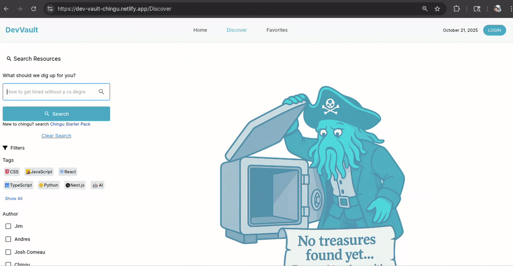
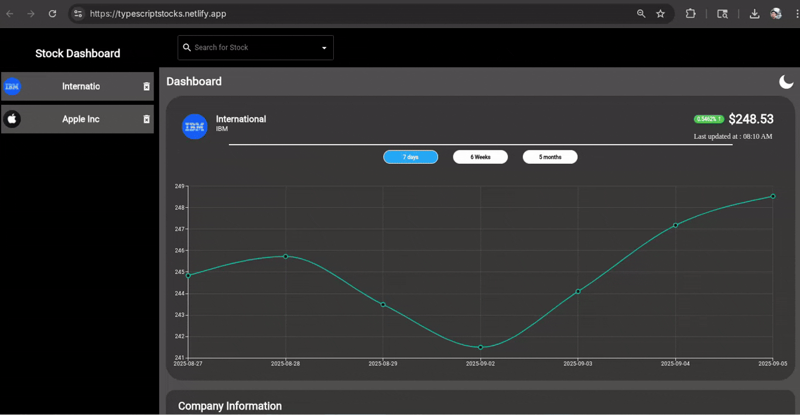

<!-- GitHub Profile README | Ivan Rebolledo | Front-End Developer -->

  

  
  
  

# Hi, I'm Ivan Rebolledo

**Frontend Developer | React • TypeScript • Next.js**

I'm a 𝗙𝗿𝗼𝗻𝘁-𝗘𝗻𝗱 𝗗𝗲𝘃𝗲𝗹𝗼𝗽𝗲𝗿 specializing in 𝙍𝙚𝙖𝙘𝙩, 𝙏𝙮𝙥𝙚𝙎𝙘𝙧𝙞𝙥𝙩, 𝙉𝙚𝙭𝙩.𝙟𝙨, 𝙏𝙖𝙞𝙡𝙬𝙞𝙣𝙙 𝘾𝙎𝙎, 𝙈𝙖𝙩𝙚𝙧𝙞𝙖𝙡 𝙐𝙄, and 𝘾𝙤𝙣𝙩𝙚𝙭𝙩 𝘼𝙋𝙄. My current interests include 𝙉𝙤𝙙𝙚.𝙟𝙨, 𝙀𝙭𝙥𝙧𝙚𝙨𝙨, 𝙋𝙤𝙨𝙩𝙜𝙧𝙚𝙎𝙌𝙇 and 𝙑𝙞𝙩𝙚𝙨𝙩.

Currently building an ESL shadowing app for language learning and planning additional educational tools. Available for new projects and opportunities.

Portfolio: ivanrebolledo.dev

---

### Technologies I work with

<table>
  <tr>
    <td align="center" width="140">
       React
    </td>
    <td align="center" width="140">
       TypeScript
    </td>
  </tr>
  <tr>
    <td align="center" width="140">
       JavaScript
    </td>
    <td align="center" width="140">
       Next.js
    </td>
  </tr>
</table>

---

## Projects

### [ShadowSpeak](https://github.com/chingu-voyages/V55-tier2-team-24)

**Tech Stack:** React, Next.js, TypeScript, Express, PostgreSQL, Azure Blob Storage

Full-stack ESL platform with browser-based audio recording (MediaRecorder API), YouTube segment looping via custom 100ms polling (YouTube API doesn't support this natively), and Azure Blob Storage integration. Built JWT authentication with role-based access control, teachers create lessons and review submissions, students record and submit. PostgreSQL with proper foreign keys and cascade deletes.

**Live Site:** https://shadowing-app-spec.vercel.app/  

---

### [DevVault](https://github.com/chingu-voyages/V55-tier2-team-24)

**Tech Stack:** TypeScript, React, Tailwind CSS, Material UI, Fuse.js, React Router

Developer resource hub with intelligent search. Built the search system: Fuse.js fuzzy matching for typo tolerance, keyword expansion that maps "js" to "javascript" and "frontend" to [HTML, CSS, JavaScript, React], plus stopword removal for cleaner results. Implemented localStorage caching with daily invalidation and Set-based deduplication to prevent duplicate results.

**Live Site:** https://dev-vault-chingu.netlify.app/  
**Case Study:** https://www.ivanrebolledo.dev/projects/devvault

---

### [Stock Dashboard](https://github.com/ivannissimrch/stockDashBoard)

**Tech Stack:** TypeScript, React, Material UI, Axios

Stock tracker with dual API integration (Finnhub for real-time quotes, Alpha Vantage for historical data). Built smart caching quotes refresh every 15 minutes, historical data daily. Transforms raw daily data into weekly and monthly averages for trend charts. Debounced search prevents API spam, recently viewed stocks load from cache instantly.

**Live Site:** https://typescriptstocks.netlify.app/  
**Case Study:** https://www.ivanrebolledo.dev/projects/stocks

---

### Let's Connect

- Email: ivannissimrch@gmail.com
- [LinkedIn](https://www.linkedin.com/in/ivan-rebolledo-012b17244)
- [Portfolio Website](https://ivanrebolledo.dev)

Open to frontend developer opportunities. Reach out if you're hiring.

---
