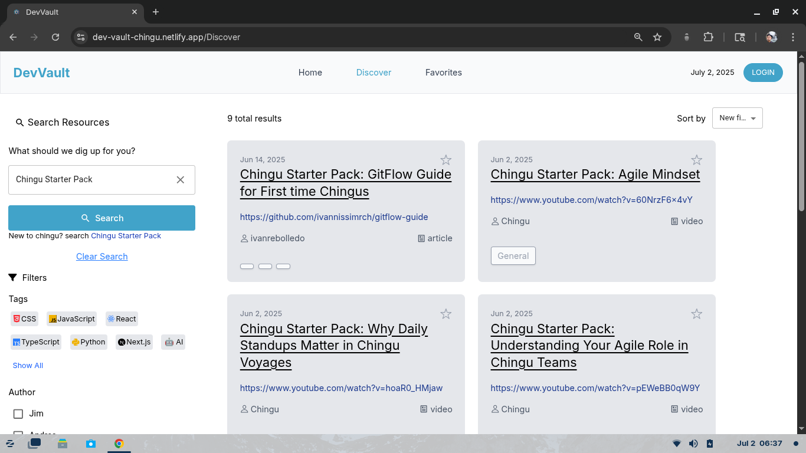
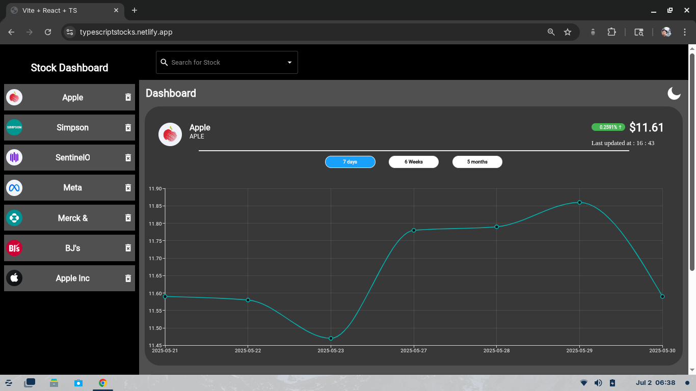

<!-- GitHub Profile README | Ivan Rebolledo | Front-End Developer -->
<!-- GitHub Profile README | Ivan Rebolledo | Front-End Developer -->

  

  
  
  

# Hi, I'm Ivan Rebolledo

**Frontend Developer | React • TypeScript • Next.js**

I'm a Front-End Developer focusing on React, TypeScript, JavaScript, Next.js, Tailwind CSS, and Material UI. I've built various applications, including a stock dashboard with local caching, a developer resources app featuring fuzzy search, and an AI prompt builder.

I have collaborated in Agile teams through Chingu, where I contributed to creating four different applications. My responsibilities included managing state with the Context API and local storage, developing logic to filter dishes for the Weekly Bytes app, creating forms, and utilizing libraries like React Select for drop-down menus and Fuse.js for a smart search bar.

---

## Currently Building

- Prototyping an ESL shadowing app to help English learners practice speaking and intonation
- Practicing algorithms and data structures with JavaScript
- Exploring Express and SQL to build full-stack apps
- Polishing my Stock Dashboard project

---

## Tech Stack
- **Languages**: JavaScript, TypeScript
- **Frameworks**: React, Next.js
- **Styling**: Material UI, Tailwind CSS, CSS 
- **Tools**: Git, GitHub, Vite
- **Learning**: Express, SQL, Unit Testing
---

## Projects

### [DevVault](https://github.com/chingu-voyages/V55-tier2-team-24)  
### Tech Stack: TypeScript, React, Tailwind CSS,  Material UI, Fuse.js, React-Router
Team project, I built a smart search bar with typo tolerance, fallback caching, and API cleanup for a developer resources App.
**Live Site:** https://dev-vault-chingu.netlify.app/
**Case Study:** https://www.ivanrebolledo.dev/projects/devvault

---

### [Stock Dashboard](https://github.com/ivannissimrch/stockDashBoard)  
### Tech Stack: TypeScript, React, CSS,  Material UI.
Built a stock dashboard with local caching, dual API integration, and interactive charting for time-based trends. 
**Live Site:** https://typescriptstocks.netlify.app/
**Case Study:** https://www.ivanrebolledo.dev/projects/stocks

---

### [Weekly Bytes](https://github.com/ivannissimrch/weeklyBytes)  
### Tech Stack: JavaScript, React, Tailwind CSS,  Material UI, React-Select, React-Router
Team project, I built the logic to filter allergy-safe dishes for generating workplace menus on a meal scheduling app for teams.  
**Live Site:** https://weekly-bytes.com/
**Case Study:** https://www.ivanrebolledo.dev/projects/weeklybytes

---

### Other Projects

- **[Expense Splitter](https://github.com/ivannissimrch/expenseSplitter)** — Shared expense tracker built with a Chingu team  
- **[Spotify Playlist App](https://github.com/ivannissimrch/typeScriptPlayList)** — Search songs and build playlists with Spotify API

You can explore more in my pinned repositories.

---

###  Let's Connect

-  Email: ivannissimrch@gmail.com  
-  [LinkedIn](https://www.linkedin.com/in/ivan-rebolledo-012b17244)  
-  [Portfolio Website](https://ivanrebolledo.dev)

Open to junior front-end developer roles. Let’s build something great together!

---

