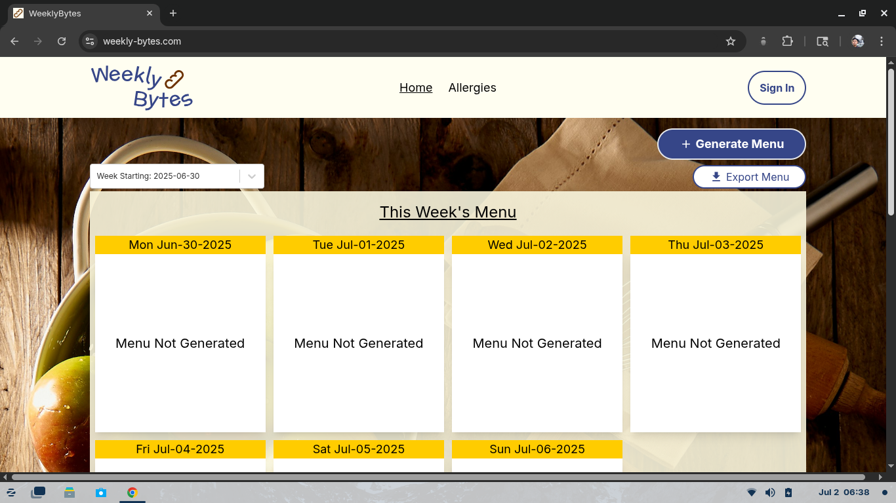

<!-- GitHub Profile README | Ivan Rebolledo | Front-End Developer -->
<!-- GitHub Profile README | Ivan Rebolledo | Front-End Developer -->

  

  
  
  

# Hi, I'm Ivan Rebolledo

**Frontend Developer | React • TypeScript • Next.js**

Welcome to my GitHub! I'm a self-taught **Front-End Developer** focused on building scalable and maintainable real-world applications using modern web technologies like **React** and **TypeScript**.

I love working on the logic, structure, and state flow of React apps.

I have 8 months of experience working in **collaborative Agile environments** through [Chingu](https://www.chingu.io/), where I've contributed to full development cycles as part of international dev teams.

---

## Currently Building

- Practicing algorithms and data structures with JavaScript
- Exploring Express and SQL to build full-stack apps
- Polishing my Stock Dashboard project
- Prototyping an ESL shadowing app to help English learners practice speaking and intonation

## Open to Opportunities

I'm actively looking for junior front-end roles. Let’s connect and build something meaningful!

---

## About Me

I'm always exploring new ways to grow as a developer, currently focusing on **React**, **TypeScript**, **unit testing**, and writing clean, efficient code.

I'm actively learning:
- Front-end best practices with guidance from [Martin Stadler](https://mentorcruise.com/mentor/martinstadler/)
- Data structures and algorithms through 1:1 tutoring with [Greem L.](https://www.wyzant.com/match/tutor/89018372)

Outside of coding, I love hiking with my miniature poodle and Latin dancing on the weekends.

---

## Tech Stack
- **Languages**: JavaScript, TypeScript
- **Frameworks**: React, Next.js
- **Styling**: Tailwind CSS, CSS Modules, Material UI
- **Tools**: Git, GitHub, Vite, Netlify
- **Learning**: Express, SQL, Unit Testing
---

## Projects

### [DevVault](https://github.com/chingu-voyages/V55-tier2-team-24)  
A resource search app for discovering curated coding content from the Chingu Discord #resources channel  
**Live Site:** https://dev-vault-chingu.netlify.app/

---

### [Stock Dashboard](https://github.com/ivannissimrch/stockDashBoard)  
A tocks searching App with real-world API integration, caching, and unit testing  
**Live Site:** https://typescriptstocks.netlify.app/

---

### [Weekly Bytes](https://github.com/ivannissimrch/weeklyBytes)  
A meal scheduling app for teams, filtering dishes based on dietary needs  
**Live Site:** https://weekly-bytes.com/

---

### Other Projects

- **[Expense Splitter](https://github.com/ivannissimrch/expenseSplitter)** — Shared expense tracker built with a Chingu team  
- **[Spotify Playlist App](https://github.com/ivannissimrch/typeScriptPlayList)** — Search songs and build playlists with Spotify API

You can explore more in my pinned repositories.

---

### 💼 Let's Connect

-  Email: ivannissimrch@gmail.com  
-  [LinkedIn](https://www.linkedin.com/in/ivan-rebolledo-012b17244)  
-  [Portfolio Website](https://ivanrebolledo.dev)

Open to junior front-end developer roles. Let’s build something great together!

---

## Just for Fun

Pac-Man chasing ghosts across my GitHub contributions

<picture>
  <source media="(prefers-color-scheme: dark)" srcset="https://raw.githubusercontent.com/ivannissimrch/ivannissimrch/output/pacman-contribution-graph-dark.svg">
  <source media="(prefers-color-scheme: light)" srcset="https://raw.githubusercontent.com/ivannissimrch/ivannissimrch/output/pacman-contribution-graph.svg">
  
</picture>

_generated with [abozanona/pacman-contribution-graph](https://abozanona.github.io/pacman-contribution-graph/)_

---
